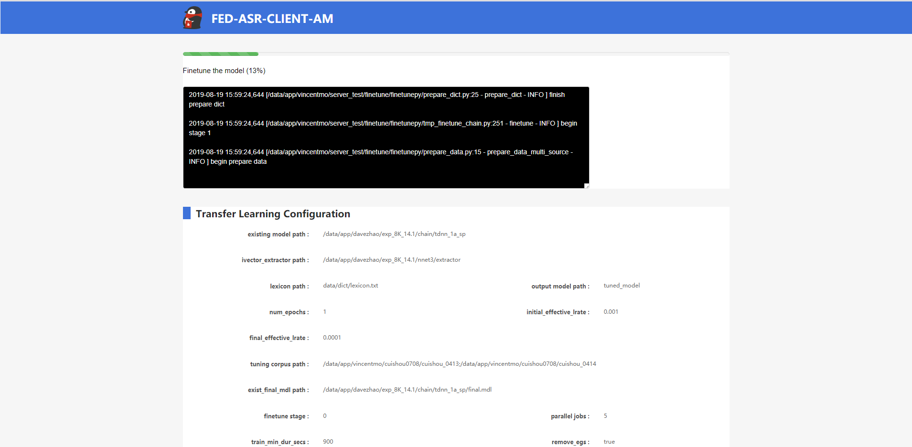

# Fed-asr-code
Fed-asr client，master界面以及与sdk联调；环境搭建在77服务器上~/vincentmo/server_test/

### 依赖环境
- python 3.5
- tornado
- flask

声明kaldi_root（77上环境已经配置好，不需要重新配置kaldi）
```bash
#export KALDI_ROOT=`pwd`/../../..
export KALDI_ROOT=/data/app/g_kaldi_train/
[ -f $KALDI_ROOT/tools/env.sh ] && . $KALDI_ROOT/tools/env.sh
export PATH=$PWD/utils/:$KALDI_ROOT/tools/openfst/bin:$PWD:$PATH
[ ! -f $KALDI_ROOT/tools/config/common_path.sh ] && echo >&2 "The standard file $KALDI_ROOT/tools/config/common_path.sh is not present -> Exit!" && exit 1
. $KALDI_ROOT/tools/config/common_path.sh
export LC_ALL=C
```

运行程序

```shell
cd finetune
sh server.sh
```

### 代码主要架构
- index_templates：

/finetune

------finetunepy/templates/

------------my_client.html

------------my_client_finish.html

------------my_client_decode.html

------------my_client_lm.html

------------my_client_upload.html

------------my_master.html

------------my_master_finish.html

------------my_master_decode.html

- css、js:

/finetune

------finetunepy/static/

- handlers:

/finetune

------finetunepy/handles/

------------client.py

------------client_gen.py

------------client_decode.py

------------client_lm.py

------------client_upload.py

------------master.py

------------master_gen.py

------------master_decode.py

------------handler.py

------------service.py

- url,application,server

------finetunepy

------------url.py

------------application.py

------------server.py

- decode

/decode_wav

/decode_wav_master

```shell
cd finetune
cp final_mdl  ../decode_wav/models/chain/chain/tdnn_1a_sp/
sh ../decode_wav/decode_batch.sh testing_corpus_address
```

- wer_evaluation

/evaluation

```shell
cd finetune
cp transcript_path ../evaluation/
cp hypo ../evaluation/
sh ../evaluation/run_compute_wer.sh.bak0626 transcript.txt hypo.txt wer_result
```

- merge_model

/model_merge

```shell
cd finetune
sh ../model_merge/run.sh
```

- train_lm

/train_lm

/train_lm_master

```shell
cd finetune
# is_merge == False 
sh ../train_lm/update_lm.sh transcript_path output_path
# is_merge == True
sh ../train_lm/update_lm_merge.sh transcript_path output_path Lambda
```


### 前端网页具体说明

/client: 用户设置AM模型finetune参数，分为专家模式和非专家模式；


/client_gen: finetune模型的设置参数，finetune进度条，finetune log；


/client_decode：基于用户数据集进行decode，最后显示finetune前后的WER对比；


/client_lm：用户训练LM模型，可以通过设置lambda决定是否与服务器后台的大的LM模型进行融合，生成tuned LM模型；


/client_upload：用户将finetune的AM模型和LM模型上传服务器server；server在后台将不同用户的AM模型进行merge_model操作；

/master：maser融合多用户AM模型界面（输入AM模型路径，默认模型名称为final.mdl）


/master_gen：Evolutionary Learning 设置参数，merge model进度条；


/master_decode：基于master数据集进行decode，最后显示不同用户模型与融合后模型的WER对比；


### api功能说明

具体代码实现（path）：/finetune/finetunepy/handlers/service.py;/finetune/finetunepy/handlers/handlers.py

/client/decode： client对数据集进行decode功能（finetune前）并且返回wer
```python
# handlers.py
class ClientDecodeHandler(tornado.web.RequestHandler):
 def initialize(self):
  # 初始化时引入对应的 Service
  self.decode_service = service.DecodeService()
  self.wer_service = service.WerService()
  self.hclg_service = service.HCLGService()
        
# service.py
class HCLGService(object):
    def make_mclg_fst(self, lang_dir, lexicon, language_model_path, format_lm_dir, existing_model_path, dest_graph_dir, res):
        # 传入format_lm.sh、make_hclg_fst.sh所需要参数，返回res（状态码以及是否成功运行的log）
        
class DecodeService(object):
    def decode_corpus(self, exist_final_mdl, testing_corpus_address, transcript_path, hypo, res):
        # 传入声学模型路径，测试corpus以及ground_truth的路径，decoding结果输出为hypo。这里会将文件移动到decode_batch.py当前目录
     
class WerService(object):
    def get_wer(self, wer_result, res):
        # 输出wer_result(txt文件)
```

/client/decode2：client对数据集进行decode功能（finetune后）并且返回wer

/client/train_lm：client训练lm模型


/client/upload_data：client finetune上传设置参数
```python
# handlers.py
class ClientUploadHandler(tornado.web.RequestHandler):
    def initialize(self):
  # 初始化时引入对应的 Service
  self.finetune_service = service.FinetuneService()
        
# service.py
class FinetuneService(object):
    def finetune_model_run(self, finetuner, data_dict):
        # finetuner = tmp_finetune_chain.ChainFinetuner()
        # data_dict 为用户上传的参数
        finetuner.finetune(data_dict)
```

/client/language_model： LM模型上传路径

/client/acoustic_model： AM模型上传路径

/client/download：用户下载master融合后的模型路径

/websocket：finetune log返回路径

/master/merge： master进行merge_model操作
```python
# handlers.py
class MasterMergeHandler(tornado.web.RequestHandler):
 def initialize(self):
  # 初始化时引入对应的 Service
  self.merge_service = service.MergeService()
        
# service.py
class MergeService(object):
    def merge_model_run(self, models_list, index):
        #传入models_list（需要融合clients_model的path，默认文件名为final.mdl），index为模型数目
```

/master/decode：master对数据集进行decode功能（client 模型）并且返回wer

/master/decode2：master对数据集进行decode功能（融合后模型）并且返回wer

（这里有多个decode api是因为多进程操作同时访问同一个decode的时候会发生错误）

### audio decode online system
配置online decode环境，具体操作可以查询77 server： **~/davezhao/asr_sdk/kaldi/egs/webank/online-chain/README.md**

```shell
cd  ~/davezhao/asr_sdk/kaldi/egs/webank/online-chain
#activate py27
conda activate py27
#启动server
python kaldigstserver/master_server.py --port=9999
#启动worker
python kaldigstserver/worker.py -u ws://localhost:9999/worker/ws/speech -c sample_chinese_chain.yaml
```

```shell
cd decode_msg
python app.py
```
/：上传音频，对音频进行解码并且计算wer数值。同时也支持录音解码。


### GA算法可视化
我们首先用一个很简单的例子来阐述GA算法：使用GA算法生成一个含有N个数字的列表，其中所有数字之和为X。（以下代码只能简述GA算法的实现流程，并不是merge model的具体代码，但可以从中领会merge model所使用的GA算法）
参数初始化：
```
# 发生基因交叉的概率
self.c_rate = c_rate
# 发生基因变异的概率
self.m_rate = m_rate
# 种群中个体数目
self.pop_size = pop_size
# 种群迭代次数
self.ga_num = ga_num
```
遗传算法的相关术语：
individual（指染色体带有特征的个体）：加载各个城市经纬度以及城市名称。个体为不同城市之间的路径<---------->在我们的merge_model算法中独立的client_am_model可以看做是一个individual
``` python
def load_Citys2(self, file='china.csv', delm=';'):
    # 中国城市经纬度
    data = pd.read_csv(file, delimiter=delm, header=None).values
    self.citys = data[:, 1:]
    self.citys_name = data[:, 0]
    self.city_size = data.shape[0]
```

population（个体的集合，该集合内个体数称为种群的大小。）：所有城市之间路径的集合<---------->原始client_am_model和finetune_am_model的集合
``` python
def creat_pop(self, size):
    pop = []
    for i in range(size):
        gene = np.arange(self.citys.shape[0])
        np.random.shuffle(gene)
        pop.append(gene)

    return np.array(pop)
```

fitness function（度量某个物种对于生存环境的适应程度。）：路径的distance（路径越小适应性越好）<---------->am_model的WER（WER越低适应性越好）
```python
def get_fitness(self, pop):
    d = np.array([])
    for i in range(pop.shape[0]):
        gen = pop[i]  # 取其中一条染色体，编码解
        dis = self.gen_distance(gen)
        dis = self.best_dist / dis
        d = np.append(d, dis)  # 求路径长
    return d

def get_local_fitness(self, gen, i):
    '''
    :param gen:城市路径
    :param i:第i城市
    :return:第i城市的局部适应度
    '''
    di = 0
    fi = 0
    if i == 0:
        di = self.ct_distance(self.citys[gen[0]], self.citys[gen[-1]])
    else:
        di = self.ct_distance(self.citys[gen[i]], self.citys[gen[i - 1]])
    od = []
    for j in range(self.city_size):
        if i != j:
            od.append(self.ct_distance(self.citys[gen[i]], self.citys[gen[i - 1]]))
    mind = np.min(od)
    fi = di - mind
        return fi
```

进化过程（在进化过程中会发生选择，复制，基因重组，变异，child_am_model的参数更新可以通过调整father_am_model和mother_am_model的参数比例进行更新：w^{'} = \lambda * w_{father} + (1 - \lambda) * w_{mother}
``` python
#自然选择
def select_pop(self, pop):
    best_f_index = np.argmax(self.fitness)
    av = np.median(self.fitness, axis=0)
    for i in range(self.pop_size):
        if i != best_f_index and self.fitness[i] < av:
            pi = self.cross(pop[best_f_index], pop[i])
            pi = self.mutate(pi)
            pop[i, :] = pi[:]

    return pop
    
# 基因重组
def cross(self, parent1, parent2):
    """交叉"""
    if np.random.rand() > self.c_rate:
        return parent1
    index1 = np.random.randint(0, self.city_size - 1)
    index2 = np.random.randint(index1, self.city_size - 1)
    tempGene = parent2[index1:index2]  # 交叉的基因片段
    newGene = []
    p1len = 0
    for g in parent1:
        if p1len == index1:
            newGene.extend(tempGene)  # 插入基因片段
        if g not in tempGene:
            newGene.append(g)
        p1len += 1
    newGene = np.array(newGene)

    if newGene.shape[0] != self.city_size:
        print('c error')
        return self.creat_pop(1)
        # return parent1
    return newGene
    
# 基因变异
def mutate(self, gene):
    """突变"""
    if np.random.rand() > self.m_rate:
        return gene
    index1 = np.random.randint(0, self.city_size - 1)
    index2 = np.random.randint(index1, self.city_size - 1)
    newGene = self.reverse_gen(gene, index1, index2)
    if newGene.shape[0] != self.city_size:
        print('m error')
        return self.creat_pop(1)
    return newGene

def evolution(self):
    tsp = self
    for i in range(self.ga_num):
        best_f_index = np.argmax(tsp.fitness)
        worst_f_index = np.argmin(tsp.fitness)
        local_best_gen = tsp.pop[best_f_index]
        local_best_dist = tsp.gen_distance(local_best_gen)
        if i == 0:
            tsp.best_gen = local_best_gen
            tsp.best_dist = tsp.gen_distance(local_best_gen)

        if local_best_dist < tsp.best_dist:
            tsp.best_dist = local_best_dist
            tsp.best_gen = local_best_gen
            tsp.dw.ax.cla()
            tsp.re_draw()
            tsp.dw.plt.pause(0.01)
        else:
            tsp.pop[worst_f_index] = self.best_gen
        print('gen:%d evo,best dist :%s' % (i, self.best_dist))
        self.distance_list.append(self.best_dist)


        tsp.pop = tsp.select_pop(tsp.pop)
        tsp.fitness = tsp.get_fitness(tsp.pop)
        for j in range(self.pop_size):
            r = np.random.randint(0, self.pop_size - 1)
            if j != r:
                tsp.pop[j] = tsp.cross(tsp.pop[j], tsp.pop[r])
                tsp.pop[j] = tsp.mutate(tsp.pop[j])
        self.best_gen = self.EO(self.best_gen)
        tsp.best_dist = tsp.gen_distance(self.best_gen)
```
fitness随着generation的增加不断降低


随着generation增加，动态展示GA应用在TSP的最短路径选择问题


